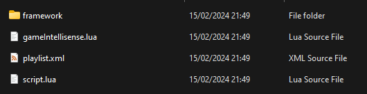

# *Aurora Framework*

## ⚠️ | Outdated
This framework has been superseded by [**Noir**](https://github.com/cuhHub/Noir).

This framework will still be maintained, but it is recommended to use Noir as it is better with performance, easy to use, helps with addon structure, and much more.

## 📚 | Overview
Aurora Framework is a super reliable OOP-based framework that makes the creation of Stormworks: Build and Rescue (game) addons much easier.

As said, the framework makes creating addons easier, here's an example of that:

```lua
-- Without Aurora Framework
local timer = 0

function onTick()
    timer = timer + 1

    if timer % 60 ~= 0 then
        return
    end

    server.announce("Woah", "A second has passed.")
end
```

```lua
-- With Aurora Framework
AuroraFramework.services.timerService.loop.create(1, function()
    AuroraFramework.services.chatService.sendMessage("Woah", "A second has passed.")
end)
```

You can view examples over in the `examples` folder.

## 😔 | Quirks
- There is no type checking or anything of the sorts within the framework. I've learned to incorporate type checking in my projects, but that was way after I made this framework. It is too late to add it now since it will take forever.
- The `AuroraFramework.libraries.class.create()` function is quite funky, and the classes aren't that optimized (it creates a new function every time). I didn't know much about OOP at the time.
- Large lag spikes in a server that an addon using this framework is running in may trigger the Debugger Service's addon error detection.

## 📃 | Features
- **Services** - This framework contains numerous functions/"classes" for different things that are categorized depending on what they do. These functions/"classes" go under services.
- **OOP-Based** - This framework is entirely OOP-based. To apply something to a player, or a vehicle, you must find the player/vehicle object and call a method inside of the object.
- **Reliable** - This framework is consistently maintained and works extremely well.
- **Intellisense Support** - This framework utilizes [Lua LSP's](https://marketplace.visualstudio.com/items?itemName=sumneko.lua) annotations feature to provide full intellisense (auto-completion, etc) support. Please note that you'll need to have the [Lua LSP extension](https://marketplace.visualstudio.com/items?itemName=sumneko.lua) and the [Stormworks Addon Lua documentation](https://github.com/Cuh4/StormworksAddonLuaDocumentation) for intellisense. See 3rd step of setting up for more info.
- **Less Work** - This framework handles so much of the tough stuff for you. You won't need to create tables to track players, vehicles, and such. There are also plenty of helper functions in the framework's libraries that you can utilize.
- **Libraries** - This framework has numerous libraries that contain functions you might need during addon development. This speeds up development time as you won't need to create as many functions single-handedly.

## 💾 | Installation
Stormworks addons are located at `%appdata%/Stormworks/data/missions`.

### 💽 | Setting up
1) `git clone` this repo into your addon's folder: `git clone "https://github.com/Cuh4/AuroraFramework"`
2) Move `src/framework` into your addon's folder. This will provide the framework itself (`AuroraFramework.lua`), as well as intellisense for the framework (`intellisense.lua`).
3) **[Optional]** Move `docs/intellisense.lua` from [this repo](https://github.com/Cuh4/StormworksAddonLuaDocumentation) into your addon's folder. This will provide intellisense (auto-completion, etc) for Addon Lua.

Your addon's folder should now look like:



Note that `intellisense.lua` from the repo mentioned above was renamed to `gameIntellisense.lua`.

### 📖 | Utilizing Aurora Framework
Now, for actually using the framework, you can either:

- **Take the `require()` route:**
    1) Install the [Stormworks Lua Visual Studio Code extension](https://marketplace.visualstudio.com/items?itemName=NameousChangey.lifeboatapi).
    2) Use the extension's `require("path.to.file")` support feature with your addon's framework file.
        ```lua
        -- file: script.lua
        -- merges everything in framework/AuroraFramework.lua with your script.lua file once you build your addon using the extension
        require("framework.AuroraFramework")

        -- your addon code
        AuroraFramework.services.chatService.sendMessage("Server", "Hey all!")
        ```
    3) Build your addon using the extension. You'll have to do this everytime you make a change to your addon.

- **Take the all-in-one route:**
    1) Copy the contents of your addon's `framework/AuroraFramework.lua`.
    2) Paste it into your addon's `script.lua` file. Be sure to paste it above all of your addon code, not below it.
        ```lua
        -- file: script.lua
        -- the entirety of the framework
        AuroraFramework = {...} -- it won't look *exactly* like this

        -- your addon code
        AuroraFramework.services.chatService.sendMessage("Server", "Hey all!")
        ```

    - **Note:** You can create your own script to automatically combine the framework with your addon's `script.lua`. This is what I personally do.

## ⚠️ | Warnings
- This framework gets updated quite frequently, so you may need to repeat the installation steps above there and then.
- This framework doesn't include actual documentation because this was made purely for myself originally. The framework does utilize typehinting and basic function annotations for intellisense support though.
